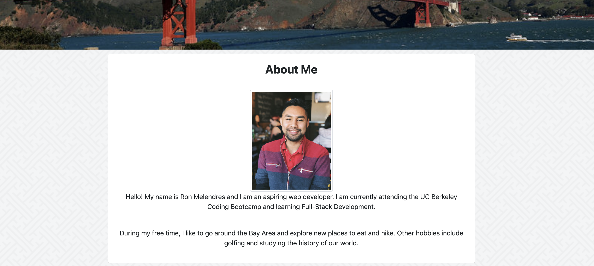

# My-Portfolio

## Summary 

This is the first updated version of My Portfolio. It uses Bootstrap for the basic layout.

## Site Picture



## Technologies Used

Bootstrap - Bootstrap is used to create the basic layout of the page. The main aspects from Bootstrap used is the navbar and cards.

HTML- Used to create the basic structure of the page.

CSS- Adds scrolling behavior, background image, and some style to the sections and text of the page.

## Code Snippet

The snippet shown is mainly the navbar portion that contains the links to the "About", "Portfolio", and "Contact" sections. However one small detail that I have not done before is in the hrefs, instead of a link going to another page, it directs to another id. By doing this, and adding in the css file "scroll behavior", when you click on of the three options, the page will automatically scroll down to the section. 

``` html

 <div class="collapse navbar-collapse justify-content-end" id="navbarSupportedContent">
                <ul class="nav">
                    <li class="nav-item">
                        <a class="nav-link" href="#about-me">About</a>
                    </li>
                    <li class="nav-item">
                        <a class="nav-link" href="#portfolio">Portfolio</a>
                    </li>
                    <li class="nav-item">
                        <a class="nav-link" href="#contact">Contact</a>
                    </li>
            </div>